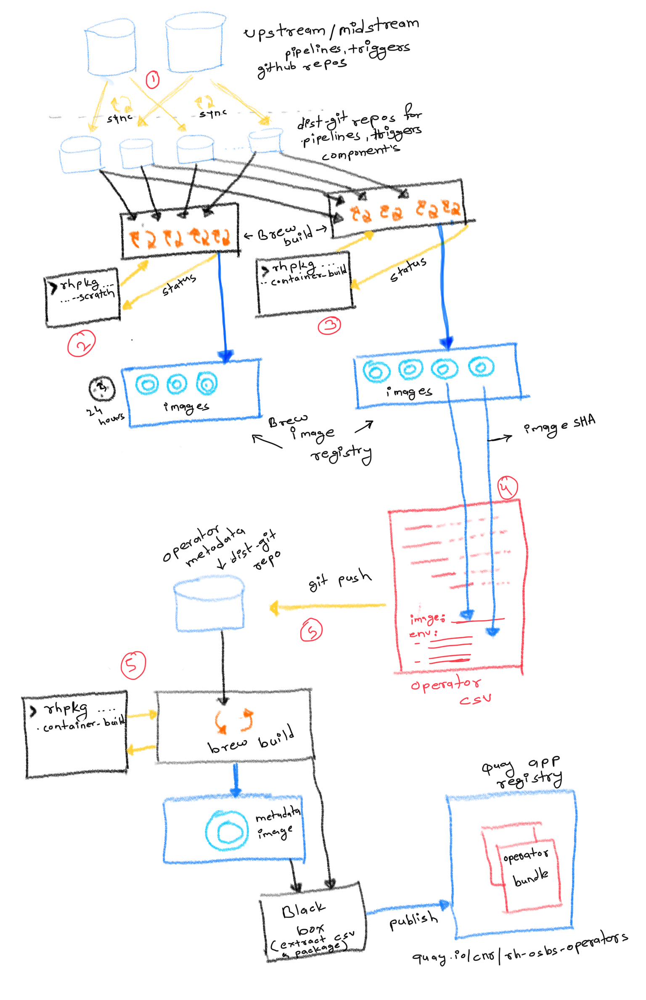
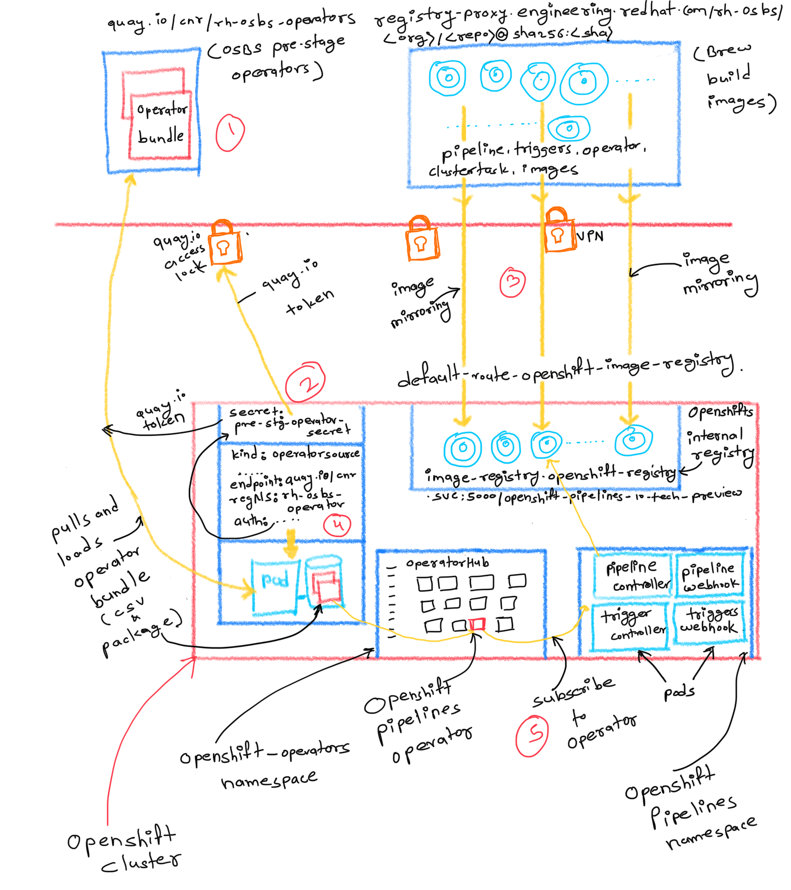

# OpenShift pipelines p12n setup


### Prerequisite
* [rhpkg](https://gitlab.cee.redhat.com/tekton/team-docs/blob/master/productisation/PREREQUISITE.md)
* python 3.7+ and pip
* Get access to quay aplication repositories, so you can [test the OpenShift pipelines operator](#testing-opensift-pipelines-through-operator). Please use this [doc](https://docs.google.com/spreadsheets/d/1OyUtbu9aiAi3rfkappz5gcq5FjUbMQtJG4jZCNqVT20/edit#gid=0) or follow the [guide](https://mojo.redhat.com/docs/DOC-1202657). It might take day or some hours to get you an access.

### Setup 
* Execute `curl https://gist.githubusercontent.com/hrishin/90e7df87263c03801546ded814cd2947/raw/120f4004fe28dc61558daf29b3221cadc5e88f15/p12n-setup | bash`

or 

* Execute `git clone git@gitlab.cee.redhat.com:tekton/productize-pipelines.git $HOME/work/op-p12n/productize-svls`
* Then fire `./setup.sh`


## Config

* **[config.sh](./config.sh)**: 
  - This file holds the general configuration about cloning and sync the source code. `*_UPSTREAM_URL` and `*_UPSTREAM_BRANCH` holds upstream pipeline's, trigger's, operator's repo URL and branch to clone.
* **[image-config.yaml](./image-config.yaml)**: 
  - This file holds the configuration for building and mirroring images for pipelines, triggers, operators, operator's metadata and catalog components.
  - `replace`: This attribute determins how to generate `ENV` var for operator's container image, so images could be overriden as per the [operator configuration](https://github.com/openshift/tektoncd-pipeline-operator#override-images). Example 
     ```
     components:
      pipelines:
      - brew-package: openshift-pipelines-controller-rhel8-container
        name: pipelines-controller-rhel8
        replace: tekton-pipelines-controller
     ``` 
     `ENV` var gets generated here is like `PIPELINES_TEKTON_PIPELINES_CONTROLLER`. i.e. `<component name>_<replace>`. 
  - `brew-package`: Is used to fetch build info by package name.
  - `dir`: Is the components directory. Used when bulding an image using `rhpkg`
  - `name`: Is used as image repo name while forming an image URL 
  - `registry`: Used to deftimine image registry org while forming an image URL.  


## Build Pipeline, Trigger, Operator images Flow Overview

<p align="center">
  
</p>

1) Sync source code(midstream) into pipelines, triggers and task catalog containers `dist-git` repositories(source code sync). Follow [Sync Source Code](#sync-source-code) section.
2) Start executing scratch containers build for all these repositories, to ensure all containers are getting build successfully. Follow [Test Containers Builds](#test-container-builds) section.
3) Start executing containers build for all these repositories. Resultant container images get available at brew image registry. These images will be used for the actual release. Follow [Build Images](#build-images) section.
4) Populate the operator CSV manifests to refer images build form the last step. Manifest is present `operator-metadata` `dist-git` repo. This is already take care by [Build Images](#build-images). However If someone has already build images or you just want to reflect the image reference without build its, follow [Refelct Images SHA in operator CSV](#refelct-images-sha-in-operator-csv) section.
5) Commit and push the CSV changes to `dist-git` repo. Build the `operator-metadata` image to publish the CSV manifest to `quay` application registry. Follow [Build Operator Meta](#build-operator-meta) section.


### Sync Source Code
```
make sync-source
```

### Test Container Builds
To test containers build, brew allows executing the scratch build where build artifacts get discarded after some time.

```
make test-image-builds
```

### Build Images
To build images that can be used for actual testing and release to stage, prod environment execute

```
make release-images
```

### Refelct Images SHA in operator CSV
```
make update-csv-image-ref
```

### Build Operator Meta
```
make release-meta
```

## Testing OpenSift Pipelines through Operator

### Prerequisite
1) Make sure you have access to any OpenShift 4 cluster and logged in as a `admin` user
2) Create a namesapce definde as per the [.mirror.to-namespace](./image-config.yaml) config
3) Reflect the correct internal `OpenShift registry` URL in [.mirror.to-registry](./image-config.yaml) config. Execute `oc get route -n openshift-image-registry -o=jsonpath='{.items[0].spec.host}'` to get the registry URL
4) Log into `OpenShift registry` using `oc registry login --insecure=true`

### Flow
<p align="center">
  
</p>

1) Make sure operator manifests are published to the quay application registry from previous build flow steps. If not then no worries, one of the following step ensures that.

2) The operator manifests bundle is present in `quay.io` application repository which has limited access (check [Prerequisite](#Prerequisite)). To access the operator metadata, a user needs to obtain the quay `token` and needs to create `secret` in the OpenShift cluster. 
    ```
    TOKEN=$(curl -sH "Content-Type: application/json" -XPOST https://quay.io/cnr/api/v1/users/login -d '
    {
      "user": {
        "username": "'"${QUAY_USERNAME}"'",
        "password": "'"${QUAY_PASSWORD}"'"
      }
    }' | jq -r '.token')
    ```
    where the `QUAY_USERNAME` -> `rh-osbs-operators+<name>`, `QUAY_PASSWORD` -> robot token recived in encrypted email.

    Create a secret using Quey token

    ```
    oc create secret generic pre-stage-operators-secret --from-literal token="${TOKEN}" -n openshift-marketplace
    ```
3) All the images built in the previous section are present in brew's registry which could be accessed over RH VPN connection only. However, it's not possible/feasible to configure the OpenShift cluster to access the registry over the VPN connection. Hence we need to mirror those images from brew image registry(registry-proxy.engineering.redhat.com/rh-osbs) to OpenShift internal registry into `openshift-pipelines-10-tech-preview` namespace. Follow [Publish Operator](#publish-operator) section. The reason it called `publish operator` because it gets the latest build images SHA, updates CSV, commit changes to dist git, publishes the operator metadata to quay registry and mirrors those images to target OpenShift cluster.
4) Create an `OperatorSource` resource in OpenShift cluster which points to the quay application registry and load the operator bundle. 
`OperatorHub` of OpenShift cluster refers to these bundles and enables the operator. Follow [Enable Operator](#enable-operator) section.
5) Subscribe to the `OpenShift Pipelines Operator` and it will spin up all pipelines resources in the OpenShift Cluster


🎉 tada!


### Publish Operator
```
make publish-operator
```

### Enable Operator
```
make enable-operator
```


## Customize your "workspace"

You can customize some element of this by using environment
variables. One use case would be to use `direnv` and have an `.envrc`
looking like the following:

```bash
export SCRIPT_DIR=${HOME}/src/gitlab.cee.redhat.com/hshinde/productize-svls
export WORKSPACE_DIR=${HOME}/src/p12n
export USER=vdemeest
```